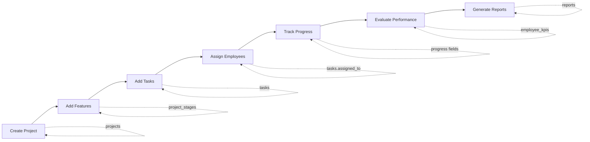

# Stratix — Database Workflow & Relationships

> مكمّل لـ [ERD.md](ERD.md) — **أهم مرحلة قبل البرمجة الكاملة**

---

## 1. الجداول الأساسية (11)

| # | Table | الغرض |
|---|--------|--------|
| 1 | `departments` | أقسام المؤسسة |
| 2 | `users` | الموظفون + الأدوار (Employee = user) |
| 3 | `projects` | المشاريع |
| 4 | `project_stages` | ميزات المشروع + **Timeline** |
| 5 | `tasks` | المهام |
| 6 | `task_comments` | تعليقات ونشاط المهمة |
| 7 | `employee_kpis` | مؤشرات أداء الموظف |
| 8 | `project_files` | مرفقات المشروع |
| 9 | `notifications` | إشعارات المستخدم |
| 10 | `reports` | تقارير مُصدَّرة (PDF/Excel) |

---

## 2. العلاقات (Relationships)

```
departments
    ├── users (department_id)
    └── projects (department_id)

users
    ├── projects.project_manager_id
    ├── tasks.assigned_to          ← Task → Employee
    ├── task_comments.user_id
    ├── employee_kpis.user_id      ← Employee → KPI
    ├── notifications.user_id
    ├── project_files.uploaded_by
    └── reports.generated_by

projects
    ├── project_stages.project_id  ← Project → Features
    ├── tasks.project_id
    ├── employee_kpis.project_id
    ├── project_files.project_id
    └── reports.project_id

project_stages
    └── tasks.stage_id             ← Feature → Tasks

tasks
    └── task_comments.task_id
```

### Timeline للمشروع

لا يوجد جدول `timeline` منفصل — **الـ Timeline = تواريخ المشروع + تواريخ كل Feature** (يمكن أن تتداخل؛ الميزات متوازية افتراضيًا).

`order_number` للعرض/الفرز فقط — **ليس** تبعية زمنية ولا شرطًا لإغلاق المشروع.

```sql
-- عرض Features لمشروع (ترتيب العرض فقط)
SELECT name, start_date, end_date, progress, status, order_number
FROM project_stages
WHERE project_id = @projectId
ORDER BY order_number;
```

---

## 3. Workflow الرسمي (من قاعدة البيانات)



| خطوة | Workflow | الجداول المتأثرة |
|------|----------|------------------|
| 1 | **Create Project** | `INSERT projects` (+ `department_id`, `project_manager_id`) |
| 2 | **Add Features** | `INSERT project_stages` (`order_number` = ترتيب عرض فقط؛ التواريخ مستقلة وقد تتداخل) |
| 3 | **Add Tasks** | `INSERT tasks` (`project_id`, `stage_id`) |
| 4 | **Assign Employees** | `UPDATE tasks SET assigned_to = user_id` |
| 5 | **Track Progress** | `UPDATE tasks.progress`, `project_stages.progress`, `projects.progress` |
| 6 | **Evaluate Performance** | `INSERT/UPDATE employee_kpis` |
| 7 | **Generate Reports** | `INSERT reports` (+ ملف في `file_url`) |

---

## 4. ترتيب تنفيذ السكربتات (SSMS)

```
001_departments.sql
002_users.sql
003_projects.sql
004_project_stages.sql
005_tasks.sql
006_task_comments.sql
007_employee_kpis.sql
008_notifications.sql
009_project_files.sql
010_reports.sql
```

---

## 5. قواعد سلامة البيانات

- حذف **مشروع** → يحذف ميزاته ومهامه وتعليقاتها (CASCADE حيث مُعرّف).
- **Employee** = سجل في `users` (ليس جدولاً منفصلاً).
- `tasks.project_id` إلزامي؛ `stage_id` و `assigned_to` اختياريان عند الإنشاء.
- KPI فريد منطقياً per (`user_id`, `project_id`, `evaluation_period`) — يُفرض لاحقاً بـ UNIQUE index إن لزم.
