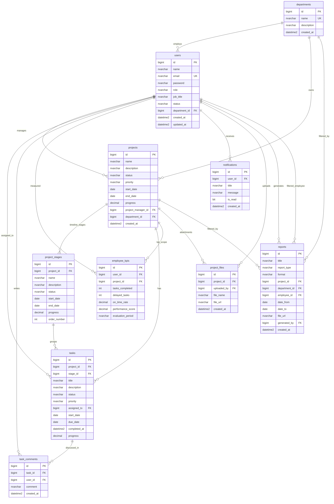

# Stratix — Database ERD (Official v1)

**SQL Server** — مرجع التصميم قبل أي تطوير Backend إضافي.

Workflow: [DATABASE_WORKFLOW.md](DATABASE_WORKFLOW.md)

---

## Entity Relationship Diagram



---

## العلاقات الأساسية (4 + باقي النظام)

| العلاقة | من | إلى | FK |
|---------|-----|-----|-----|
| **Project → Stages** | `projects` | `project_stages` | `project_id` |
| **Stage → Tasks** | `project_stages` | `tasks` | `stage_id` |
| **Task → Employee** | `tasks` | `users` | `assigned_to` |
| **Employee → KPI** | `users` | `employee_kpis` | `user_id` |
| **Project → Timeline** | `projects` + `project_stages` | — | تواريخ + `order_number` |
| Department → Users | `departments` | `users` | `department_id` |
| Project → Tasks | `projects` | `tasks` | `project_id` |
| Task → Comments | `tasks` | `task_comments` | `task_id` |
| Project → Files | `projects` | `project_files` | `project_id` |
| User → Notifications | `users` | `notifications` | `user_id` |
| User → Reports | `users` | `reports` | `generated_by` |

---

## Workflow ↔ Tables

```
Create Project      →  projects
Add Stages          →  project_stages
Add Tasks           →  tasks
Assign Employees    →  tasks.assigned_to → users.id
Track Progress      →  tasks, project_stages, projects (progress %)
Evaluate Performance→  employee_kpis
Generate Reports    →  reports
```

---

## Enum values

| Column | Values |
|--------|--------|
| `users.role` | `ADMIN`, `PROJECT_MANAGER`, `TEAM_LEADER`, `EMPLOYEE`, `EXECUTIVE_VIEWER` |
| `users.status` | `ACTIVE`, `INACTIVE`, `SUSPENDED` |
| `projects.status` | `PLANNED`, `ACTIVE`, `ON_HOLD`, `COMPLETED`, `CANCELLED` |
| `projects.priority` | `LOW`, `MEDIUM`, `HIGH`, `CRITICAL` |
| `project_stages.status` / `tasks.status` | `TODO`, `IN_PROGRESS`, `REVIEW`, `DONE`, `BLOCKED` |
| `tasks.priority` | `LOW`, `MEDIUM`, `HIGH`, `URGENT` |
| `reports.report_type` | `PROJECTS_PROGRESS`, `TASKS_STATUS`, `EMPLOYEE_PERFORMANCE`, `DELAYED_TASKS`, `KPI_SUMMARY`, `CUSTOM` |
| `reports.format` | `PDF`, `EXCEL` |

---

## Script order

`database/schema/001` … `010_reports.sql` — see [DATABASE_WORKFLOW.md](DATABASE_WORKFLOW.md)
